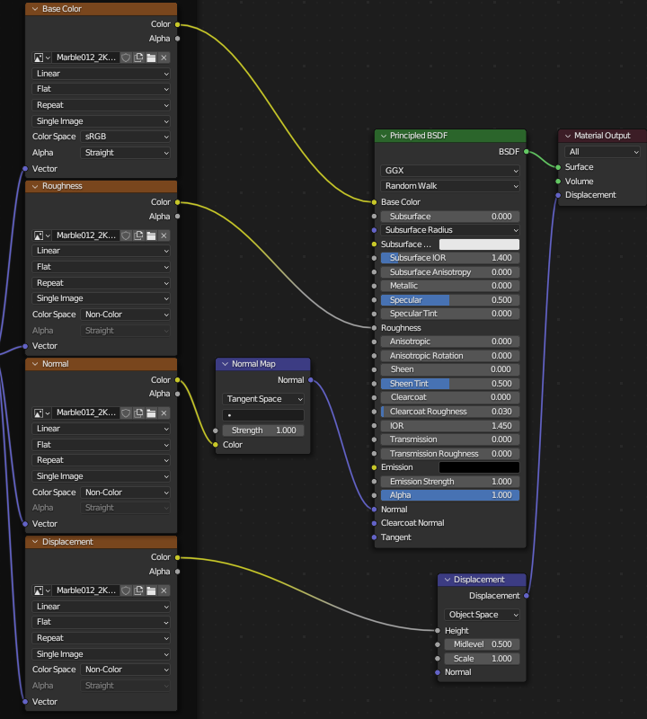
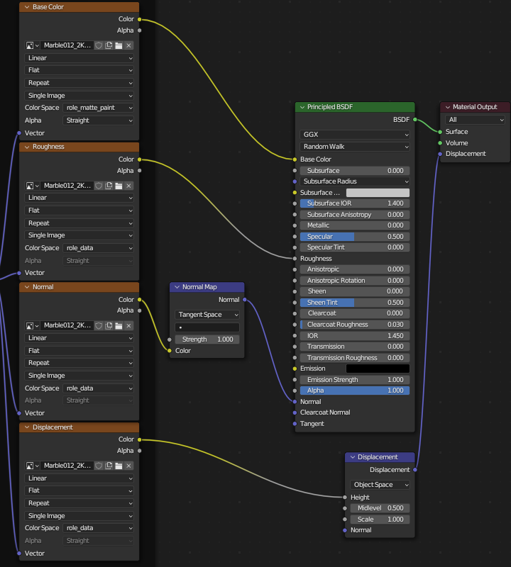
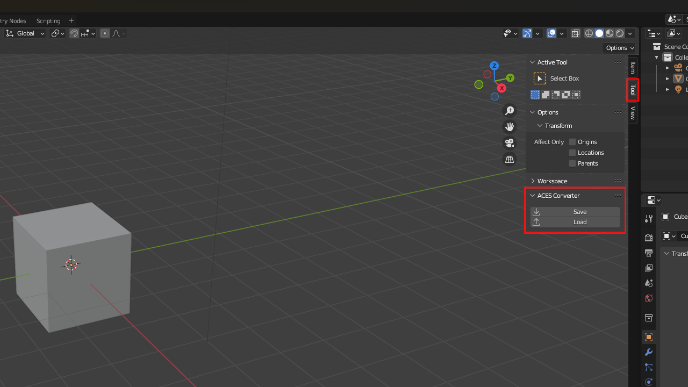

# Blender ACES converter

### What it does?

Converts **all** textures' color spaces to ACES counterparts. By default it works with [Blender-ACES-Config](https://github.com/Ginurx/Blender-ACES-Config/tree/main) by *Ginurx*, but can be easily [modified](#modifying) to work with any other one (or simply batch change colorspaces, ACES not required).

Before             |  After
:-------------------------:|:-------------------------:
  |  

### Where to find it?

3D Viewport -> Sidepanel -> Tool -> ACES Converter




### How to use?

1. Open blend file with **default** color managment
2. Click *`Save`* button
3. Close blender and change color config
4. Reopen blend ifle and click *`Load`* button

## Extras

### How it works?

- when *`export`* is clicked script goes through all textures inside current blend file and saves name of colorspace for each one into `tmp.txt`
- After changing OCIO config (and thus available colorspaces) the previous ones may not exist anymore, so when *`import`* is clicked all colorspaces are set to the ones defined in the script (following the same order from `tmp.txt`).

### Modifying

If you want to use it for other colorspaces (it will be implemented in UI, some day...) then simply change these lines in `script.py`:
  
```py
58            if color[i] == "sRGB":
59                m.colorspace_settings.name = 'role_matte_paint'
60            elif color[i] == "Non-Color":
61                m.colorspace_settings.name = 'role_data'
62            elif color[i] == "Linear":
63                m.colorspace_settings.name = 'Utility - Linear - sRGB'
```